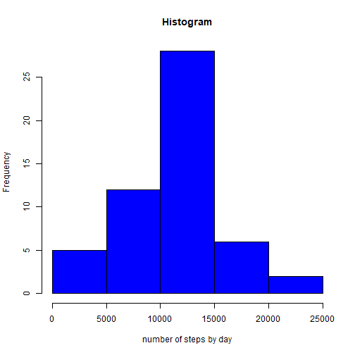
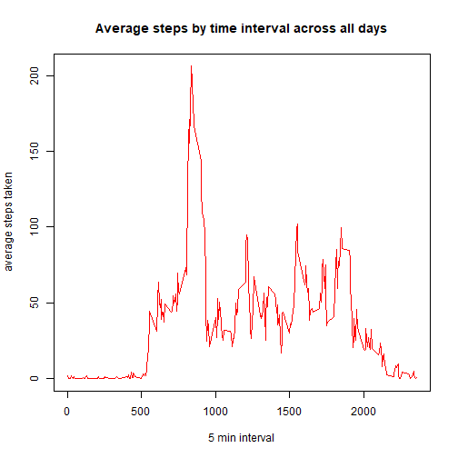
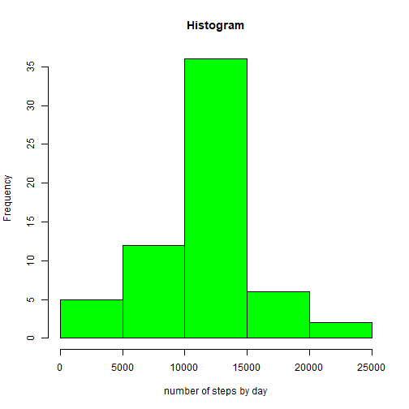
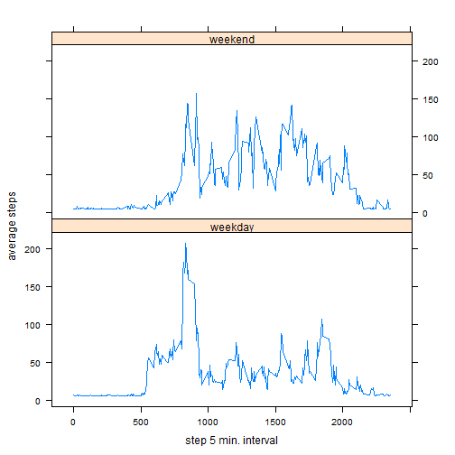

# Course Project 1
==================

## Loading and preprocessing the data

```r
temp <- tempfile()
download.file("https://d396qusza40orc.cloudfront.net/repdata%2Fdata%2Factivity.zip",temp)
AMD <- read.csv(unz(temp,"activity.csv"))
unlink(temp)
AMD$date <- as.Date(AMD$date)
```

## histogram of the total number of steps taken each day

```r
AMD_by_day <- aggregate(AMD$steps, by = list(AMD$date), FUN = sum)
hist(AMD_by_day$x, xlab = "number of steps by day", main = "Histogram", col = "blue" )
```



## Mean of the total number of steps taken per day

```r
mean(AMD_by_day$x, na.rm = TRUE)
```

```
## [1] 10766.19
```
## Median of the total number of steps taken per day

```r
median(AMD_by_day$x, na.rm = TRUE)
```

```
## [1] 10765
```
## Time series plot of the average number of steps taken

```r
AMD1 <- AMD[complete.cases(AMD),1:3]
AMD_av_by_interval <- aggregate(AMD1$steps, by = list(AMD1$interval), FUN = mean)
plot(AMD_av_by_interval$Group.1,AMD_av_by_interval$x, type= "l", xlab = "5 min interval", ylab = "average steps taken", col = "red", main = "Average steps by time interval across all days")
```



## Which 5-minute interval, on average across all the days in the dataset, contains the maximum number of steps?

```r
AMD_av_by_interval[which.max(AMD_av_by_interval[,2]),1]
```

```
## [1] 835
```
## Calculate and report the total number of missing values in the dataset (i.e. the total number of rows with NAs)

```r
sum(is.na(AMD$steps))
```

```
## [1] 2304
```
## fill in all of the missing values of steps with the mean of interval across all days in another database

```r
AMD2 <- AMD
AMD2[is.na(AMD2)] <- mean(AMD2$steps, na.rm = TRUE)
```
## Histogram of the total number of steps taken each day after missing values are imputed

```r
AMD2_by_day <- aggregate(AMD2$steps, by = list(AMD2$date), FUN = sum)
hist(AMD2_by_day$x, xlab = "number of steps by day", main = "Histogram", col = "green" )
```



## Mean of steps by day on imputed new database

```r
mean(AMD2_by_day$x)
```

```
## [1] 10766.19
```
## Median of steps by day on imputed new database

```r
median(AMD2_by_day$x)
```

```
## [1] 10766.19
```
## Do these values differ from the estimates from the first part of the assignment?
### Mean difference

```r
mean(AMD2_by_day$x)-mean(AMD_by_day$x, na.rm = TRUE)
```

```
## [1] 0
```
### Median difference

```r
median(AMD2_by_day$x)-median(AMD_by_day$x, na.rm = TRUE)
```

```
## [1] 1.188679
```
## What is the impact of imputing missing data on the estimates of the total daily number of steps?

```r
sum(AMD2$steps) - sum(AMD$steps, na.rm = TRUE)
```

```
## [1] 86129.51
```
## Create a new factor variable with “weekday” and “weekend

```r
AMD2$weekd <- weekdays(AMD2$date)
library(mgsub)
AMD2$weekd <- mgsub(AMD2$weekd, c("lunes", "martes","miércoles","jueves","viernes"), c("weekday","weekday","weekday","weekday","weekday"))
AMD2$weekd <- mgsub(AMD2$weekd, c("sábado","domingo"), c("weekend","weekend"))
```

## Panel plot containing a time series plot 5-minute interval vs. average number of steps taken, averaged across all weekdays or weekends

```r
subsetweekday <- subset(AMD2, weekd != "weekend")
subsetweekend <- subset(AMD2, weekd != "weekday")
subsetweekday_av <- aggregate(subsetweekday$steps, by = list(subsetweekday$interval), FUN = mean)
subsetweekend_av <- aggregate(subsetweekend$steps, by = list(subsetweekend$interval), FUN = mean)
subsetweekday_av$type <- "weekday"
subsetweekend_av$type <- "weekend"
all_week <- rbind(subsetweekday_av,subsetweekend_av)
library(lattice)
xyplot(all_week$x ~ all_week$Group.1 | all_week$type, layout = c(1, 2), type = "l", xlab = "step 5 min. interval", ylab = "average steps")
```


